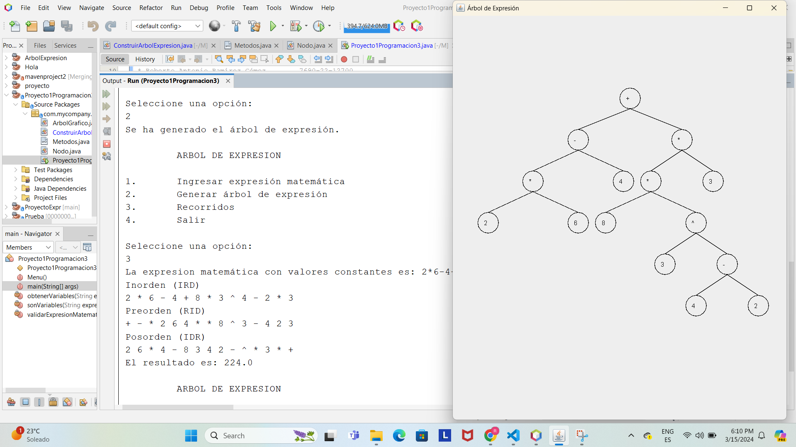

<h1><strong>PROYECTO 1 PROGRAMACION 3</strong></h1>

**Proyecto desarrollado por:** 

Jean Klaus Castañeda Santos      7690-22-892

Jonathan Joel Chan Cuellar       7690-22-1805

Roberto Antonio Ramirez Gomez    7690-22-12700

Bryan Manuel Pineda Orozco       7690-16-8869

___
[**ENLACE PARA VER LA DOCUMENTACION COMPLETA DEL PROYECTO**](https://github.com/rramirezg18/Proyecto-1-Programacion-3/blob/main/Documentacion.md "DOCUMENTACION DEL PROYECTO")
___

# **DESCRIPCION DEL PROYECTO**
El presente proyecto consiste en realizar un **algoritmo** utilizando el lenguaje de programación *Java* el cual debera solicitar una expresion matematica que puede incluir *sumas, restas, multiplicaciones, divisiones, prencias y raices* **a+b-(c-b)+e** y crear el árbol de expresión. Deberá mostrar los recorridos del arbol y el evaluar el reccorrido postorden como notación polaca es decir resolver la expresión matematica ingresada.

**Clases e Interfaz implementadas en el proyecto**

* [x] Proyecto1Programacion3.java
* [x] Nodo.java
* [x] ConstruirArbolExpresion.java
* [x] ArbolGrafico.java
* [x] Interface Metodos.java

# Video para pueba de manejo de números negativos
**Se agrego actualizacion para el manejor correcto de números negativos

